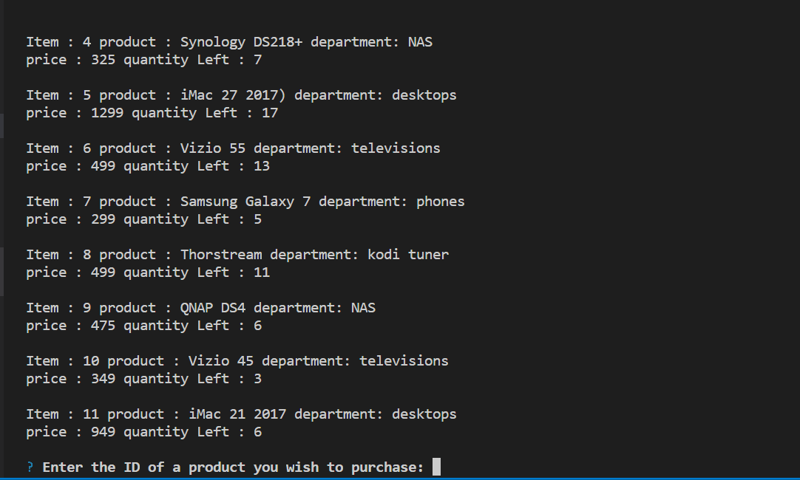

# Node.js-MySQL

## Overview

In this activity, the goal is to create an Amazon-like storefront with the MySQL skills you learnd this unit. The app will take orders from customers and deplete stock from the store's inventory. As a bonus task, you can program your app to track product sales across your store's departments and then provide a summary of the highest-grossing deparments in the store.

## Content 

* item_id (unique id for each product)
* product_name (Name of product)
* department_name
* price (cost to customer)
* stock_quantity (how much of the product is available in stores)

## Submission Requirements

#### Challenge 1: Customer View (Minimum Requirement)

* Populate this database with around 10 different products. (i.e. Insert "mock" data rows into this database and table).

* Then create a Node application called bamazonCustomer.js. 

* Running this application will first display all of the items available for sale. Include the ids, names, and prices of products for sale.

* The app should then prompt users with two messages.

The first should ask them the ID of the product they would like to buy.
The second message should ask how many units of the product they would like to buy.

Once the customer has placed the order, your application should check if your store has enough of the product to meet the customer's request.

If not, the app should log a phrase like Insufficient quantity!, and then prevent the order from going through.

However, if your store does have enough of the product, you should fulfill the customer's order.

This means updating the SQL database to reflect the remaining quantity.
Once the update goes through, show the customer the total cost of their purchase.

**The goods in the SQL database can be changed at anytime** 

If this activity took you between 8-10 hours, then you've put enough time into this assignment. Feel free to stop here -- unless you want to take on the next challenge.

### Installation and Download Requirements

The package can be downloaded or cloned to the local address using git:

```
git clone https://github.com/Zhangjt9317/Node.js-MySQL.git
```

After downloading the package, the following npm packages can be installed using the command [npm](https://docs.npmjs.com/):

```
npm download
```

Two npm pakcages are required in this assignment and included in this package:

* mysql
* inquirer

### Demo and Usage

Using node to initiate the command:

```
node bamazonCustomer.js
```

The command will ask for an itemID listed in the list of items presented (as shown in the gif below). Then it will ask you for a quantity, and if the quantity surpasses the stock, an error message will be displayed. Otherwise, a message will show up implying the transaction is done and how much money you have spent for the quantity of goods.

***The following gifs present how this app works:***

for initiating the node and displaying the list of items owned:


for selecting the itemID and quantity for normal trading:


when there is an insuffient supply of certain product:

